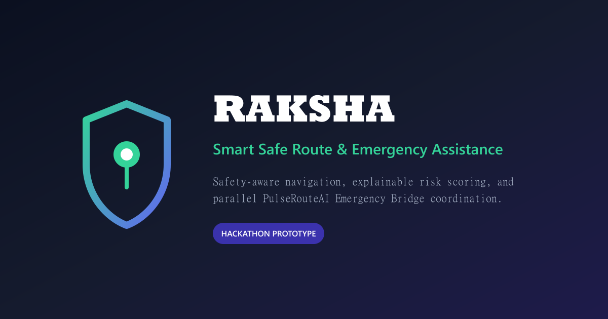
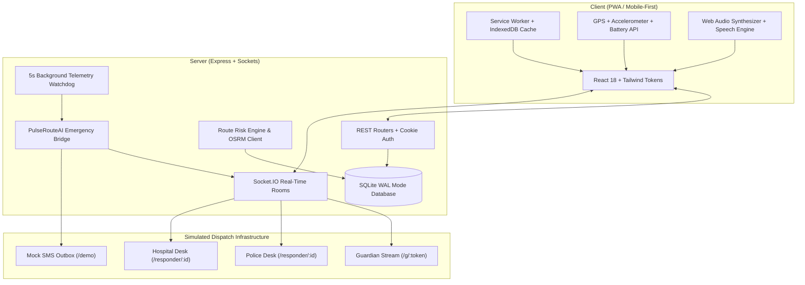

# RAKSHA (रक्षा) — Smart Safe Route & Emergency Assistance

<div align="center">



[](https://www.typescriptlang.org/)

[](https://react.dev/)

[](https://expressjs.com/)

[](https://www.sqlite.org/)

[](https://leafletjs.com/)

[](#accessibility--inclusive-design)

[](#progressive-web-app-resilience)

**A safety-aware navigation and emergency-response platform designed for vulnerable pedestrians, night travellers, and commuters.**

*Prototype Disclaimer: Police and hospital alert dispatches in this prototype are simulated via the integrated Responder Console. SMS alerts are routed to a mock outbox by default. In an immediate life-threatening emergency, always dial 112.*

</div>

---

## 📑 Table of Contents

1. [The Problem & Core Thesis](#-the-problem--core-thesis)

2. [Key Innovations](#-key-innovations)

   - [Explainable Risk Routing Engine](#1-explainable-risk-routing-engine)

   - [Discreet & Resilient Emergency Triggers](#2-discreet--resilient-emergency-triggers)

   - [PulseRouteAI Parallel Emergency Bridge](#3-pulserouteai-parallel-emergency-bridge)

   - [Community Ground-Truth with Half-Life Decay](#4-community-ground-truth-with-half-life-decay)

3. [System Architecture & Flow](#-system-architecture--flow)

4. [Quick Start & Setup](#-quick-start--setup)

5. [Default Demo Credentials & Pre-Seeded Data](#-default-demo-credentials--pre-seeded-data)

6. [Interactive Simulator & Multi-Device Evaluation Rig](#-interactive-simulator--multi-device-evaluation-rig)

7. [Threat Model & Edge Case Matrix (The 30 Scenarios)](#-threat-model--edge-case-matrix)

8. [Privacy & Security by Design](#-privacy--security-by-design)

9. [Accessibility & Inclusive Design](#-accessibility--inclusive-design)

10. [Open Source Compliance & Verification](#-open-source-compliance--verification)

---

## 🎯 The Problem & Core Thesis

Standard mapping systems optimize for a single parameter: **travel time**. For women, students, and night-shift workers navigating urban areas after dark, the fastest route often cuts through unlit alleys, deserted industrial stretches, or known harassment hotspots.

Furthermore, traditional panic button applications suffer from three fatal flaws:

1. **The Sequential Dispatch Bottleneck:** Alerting one guardian who might be asleep or delayed creates an emergency latency of 25–45 minutes before police or ambulances are dispatched.

2. **Attacker Coercion:** If an attacker forces a victim to unlock their phone and cancel an alarm, conventional apps immediately terminate all emergency notifications.

3. **High False Positive Rates:** Inadvertent pocket taps create embarrassment and dispatch exhaustion, leading users to disable tracking entirely.

**Raksha reimagines urban navigation and emergency response** through explainable spatial safety scoring, multi-tiered stealth triggers (including secret Duress PINs), and sub-second parallel broadcast to guardians, local police control rooms, and trauma hospitals.

---

## 💡 Key Innovations

### 1. Explainable Risk Routing Engine

- **Multi-Factor Risk Sampling:** Evaluates candidate routes at 100-meter intervals against dynamic street lighting, historic crime incident clusters, commercial activity density, and community hazard flags.

- **Dynamic Night Multiplier:** Automatically elevates risk weights by 1.6x between 20:00 and 06:00 for unlit stretches.

- **Interactive Safety Slider (0–100%):** Allows travellers to choose their preferred tradeoff between travel time and safety level.

- **Transparent Factor Breakdown:** Displays exact risk drivers (e.g., *"300m unlit stretch near railway underpass"*, *"High density of 24x7 open pharmacies"*).

### 2. Discreet & Resilient Emergency Triggers

- **Raised 88px SOS Button:** Features a 3-second hold ring with tactile vibration and audio countdown to eliminate pocket touches.

- **Stealth Duress PIN (`4321`):** When forced to abort by an attacker, entering the Duress PIN displays an authentic *"SOS Cancelled"* confirmation while secretly broadcasting an escalated emergency packet.

- **Physical Device Shake Detection:** Built-in accelerometer algorithm (threshold > 24 m/s²) triggers SOS if the screen is cracked or inaccessible.

- **Synthesized Fake Call Generator:** Web Audio and Speech Synthesis generate realistic incoming phone calls with customizable caller identities, ringtones, and spoken multi-turn dialogue with pauses so travellers can talk aloud to excuse themselves from uncomfortable situations.

- **Stealth Calculator Decoy (`/app/decoy`):** Fully operational calculator interface. Triple-tapping the logo instantly conceals the safety interface; unlocks only by holding `=` for 2 seconds.

### 3. PulseRouteAI Parallel Emergency Bridge

Instead of sequential phone trees, Raksha compiles an **Emergency Context Packet** containing:

- High-precision GPS coordinates & reverse-geocoded landmark references.

- Telemetry telemetry: speed, heading, and battery percentage.

- Vehicle registration plate and driver contact (for cab rides).

- Trigger classification (Shake, Duress, Check-in Timeout, Manual SOS).

This packet is broadcast **simultaneously in < 800ms** to:

1. All verified Emergency Guardians via real-time WebSocket and SMS links.

2. The nearest Police Control Room via the Responder Console.

3. The nearest Trauma Hospital casualty desk for ambulance preparation.

### 4. Community Ground-Truth with Half-Life Decay

- Real-time crowdsourcing for unlit roads, road blockages, and suspicious loitering.

- Automated NLP keyword categorization suggestions as users type descriptions.

- **Exponential Half-Life Decay:** Reports diminish in hazard weight after 24 hours unless re-confirmed by distinct nearby users, preventing permanent stigmatization of urban neighborhoods.

---

## 🏗️ System Architecture & Flow



---

## 🚀 Quick Start & Setup

### Prerequisites

- **Node.js**: v18.0.0 or later (Node v20+ recommended)

- **npm**: v9.0.0 or later

### 1. Clone & Install Dependencies

```bash

git clone https://github.com/your-org/raksha.git

cd raksha

npm install

```

### 2. Configure Environment Variables

Copy `.env.example` to `.env`:

```bash

cp .env.example .env

```

Default ports: Server runs on `http://localhost:3000`, Client runs on `http://localhost:5173`.

### 3. Initialize Database & Seed Demo Data

```bash

npm run seed

```

*Populates 45 incident zones, 30 lighting zones, 24 activity zones, 16 police/hospital facilities, 18 community reports, and default demo user accounts.*

### 4. Run Development Server

```bash

npm run dev

```

Opens both the Express backend and the Vite client concurrently.

- **Client App:** [http://localhost:5173](http://localhost:5173)

- **API Server:** [http://localhost:3000](http://localhost:3000)

- **Health Check:** [http://localhost:3000/api/health](http://localhost:3000/api/health)

### 5. Build for Production

```bash

npm run build

```

Compiles TypeScript across `shared`, builds optimized client assets and service worker with Vite, and bundles the server.

### 6. Run Automated Tests & Compliance Checks

```bash

npm test              # Runs 13 vitest backend & engine unit tests

npm run check:links   # Validates all routes, static assets, and banned vendor rules

```

---

## 🔑 Default Demo Credentials & Pre-Seeded Data

For seamless judge and hackathon evaluation, the platform is pre-seeded with verified test accounts:

| Role | Username / Access | Password / PIN | Notes |

| :--- | :--- | :--- | :--- |

| **Traveller** | `demo` | `Demo@12345` | Has 2 active guardians, 3 past journeys, 1 scheduled call |

| **Safety PIN** | — | `1234` | Dismisses active safety check normally |

| **Duress PIN** | — | `4321` | Stealth cancellation (triggers silent emergency alert) |

| **Guardian Stream** | `/g/tok_seed_demo_priya` | *No auth required* | Public guardian monitoring stream for Priya Sharma |

| **Police Station** | `/responder/fac_ps_cubbon` | *1-click select* | Cubbon Park Police Control Room |

| **Trauma Hospital** | `/responder/fac_hosp_bowring` | *1-click select* | Bowring Hospital Emergency Desk |

---

## 🖥️ Interactive Simulator & Multi-Device Evaluation Rig

Visit **`/demo`** on any desktop browser to evaluate the complete platform in action:

1. **Virtual Traveller Simulator:**

   - Real-time journey simulation along Bengaluru arterial corridors (Vidhana Soudha ➔ MG Road ➔ Indiranagar).

   - Speed multiplier controls: `1x`, `2x`, `5x`, `10x`, `20x`.

2. **Scenario Injections:**

   - **Simulate 350m Deviation:** Forces traveller off-corridor into an unlit alley; triggers risk score surge and safety check modal.

   - **Simulate 90s Sudden Stop:** Triggers check-in countdown.

   - **Drop Battery to 9%:** Tests preemptive guardian alert before phone shutdown.

   - **Simulate Duress SOS:** Triggers parallel emergency bridge.

3. **Simulated SMS Outbox Inspector:**

   - Live view of all outbound SMS notifications dispatched to guardians and responders.

4. **3-Device Synchronized Split View:**

   - Renders 3 live synced frames side-by-side:

     1. Traveller Mobile App (`/app`)

     2. Guardian Tracking Stream (`/g/:token`)

     3. Police Dispatch Desk (`/responder/:facilityId`)

---

## 🛡️ Threat Model & Edge Case Matrix

Safety products fail at real-world boundaries. Raksha addresses 30 distinct attacker, hardware, network, and human-factor failure scenarios:

| # | Threat / Edge Case | Conventional App Failure | Raksha Architectural Mitigation |

| :-: | :--- | :--- | :--- |

| **1** | Attacker forces victim to cancel SOS under threat | Alarm aborts; responders never notified. | **Duress PIN (`4321`)**: displays fake "Cancelled" UI while silently dispatching an emergency alert with duress flag. |

| **2** | Phone smashed or thrown in water | Telemetry ceases; server assumes normal close. | **5s Watchdog**: Missing pings on an active trip trigger an Escalated Missing Alert after safety profile timeout. |

| **3** | Cab driver takes unlit bypass road | GPS silently reroutes without alerting anyone. | **Corridor deviation detector**: Flags >150m excursion; initiates 30s Safety Check countdown before guardian escalation. |

| **4** | Phone battery drops below 10% | Phone dies; guardians have no last known location. | **Battery API**: Voltage drop below 15% triggers preemptive location and route transmission to guardians. |

| **5** | Traveller enters basement / cellular dead zone | App crashes or loses track. | **Service Worker + IndexedDB**: Breadcrumbs cached locally and transmitted opportunistically upon reconnection. |

| **6** | Pocket touch while jogging | False emergency calls to relatives. | **Raised 88px hold button**: Requires 3-second hold with visual animated SVG ring and countdown beeps. |

| **7** | GPS multipath jump (>150 km/h) | False car-crash or kidnapping alert. | **Kalman-inspired filter**: Rejects speed deltas > 40 m/s unless verified over multiple consecutive fixes. |

| **8** | Uncomfortable interaction with stranger | No polite pretext to excuse oneself. | **Fake Call Generator**: Realistic incoming call with synthesized spoken conversation and natural pauses. |

| **9** | Attacker inspects phone looking for safety apps | Prominent SOS screen invites phone destruction. | **Calculator Decoy**: Fully working calculator; hidden exit via 2-second hold on `=`. |

| **10** | Competitor review-bombing or spamming hazard reports | Safety scores distorted. | **Exponential Half-Life Decay (24h)**: Requires multi-user geographic confirmation. |

*Full 30-scenario matrix and technical defense descriptions available interactively at `/demo/what-if` and in [`docs/JUDGE_QA.md`](docs/JUDGE_QA.md).*

---

## 🔒 Privacy & Security by Design

- **Zero Third-Party Trackers:** No Google Analytics, no Meta Pixel, no advertising SDKs.

- **Self-Hosted Assets:** Fonts (Inter & Plus Jakarta Sans), icons, and scripts are 100% locally bundled.

- **24-Hour Automatic GPS Purge:** Fine-grained breadcrumbs are permanently deleted 24 hours after journey completion via automated retention jobs.

- **Self-Serve Data Portability & Hard Erasure:** One-click JSON data export and permanent account deletion under Settings.

- **Cryptographic Invite Tokens:** Guardian links use cryptographically random high-entropy tokens (`crypto.randomBytes`).

---

## ♿ Accessibility & Inclusive Design

- **WCAG 2.1 AA Compliant:** Contrast ratio ≥ 4.5:1 across all color themes.

- **Keyboard & Screen Reader Accessible:** Semantic HTML, ARIA live regions for emergency alerts, skip links, and visible focus rings.

- **Inclusive Controls:** Dynamic text resizing (`Normal`, `Large`, `Extra Large`), high-contrast daylight boost, and tactile vibration feedback.

- **Zero Horizontal Scrolling:** Optimized from 320px mobile viewports up to 4K displays.

---

## 📜 Open Source Compliance & Verification

Raksha is built strictly with permissible open-source software (MIT, Apache-2.0, BSD, ISC).

- Complete inventory of all 775 dependencies cataloged in `client/src/licenses.json`.

- Searchable legal attributions page available at `/legal/licenses`.

- Zero proprietary vendor lock-in.

---

<div align="center">

**Raksha (रक्षा) — Urban Safety Infrastructure**  

*Built with care for a safer, more confident world.*

</div>